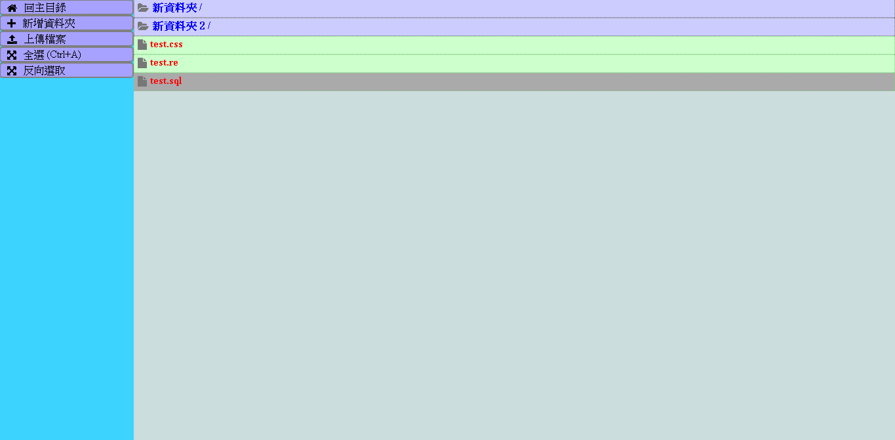

# [:octocat:file-manager](https://github.com/TCCinTaiwan/file-manager)
File Manager System

## Contents[↶](#)
* **[Introduction](#introduction)**
* **[History](#history)**
* **[Todo](#todo)**

## Introduction[↶](#)
2014/11/20 參加資工系比賽 因此寫了這個，後來在2017年重構了[:octocat:新版](https://github.com/TCCinTaiwan/TcStorage)

構成：MySQL + Php 7 + JavaScript + CSS

## History[↶](#)
* 2017-09-27
  - 優化README.md
  - 改成支援PHP 7(mysqli)

## Todo[↶](#)
  + 下版方向:
    - 預覽
    - 擴充資料庫欄位(檔案資訊、設定主目錄)
  + 值得改進:
    - 多選-shift
    - 背景
    - 線上編輯
    - UI還是太醜
    - CSS排版
    - 安全性
    - 帳號密碼
    - 快速鍵
    - 使用提示
